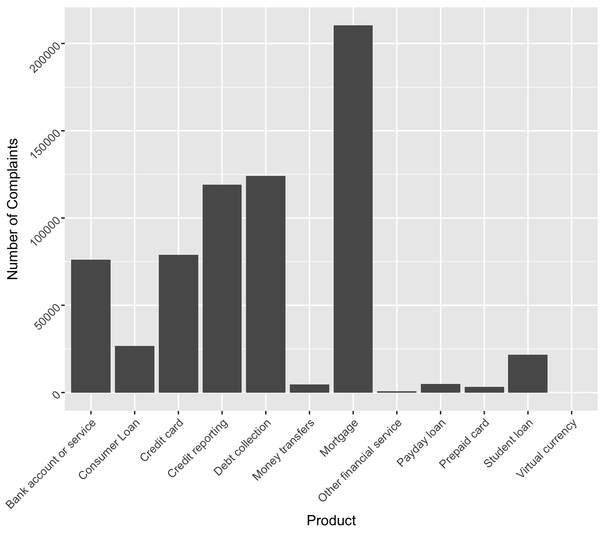
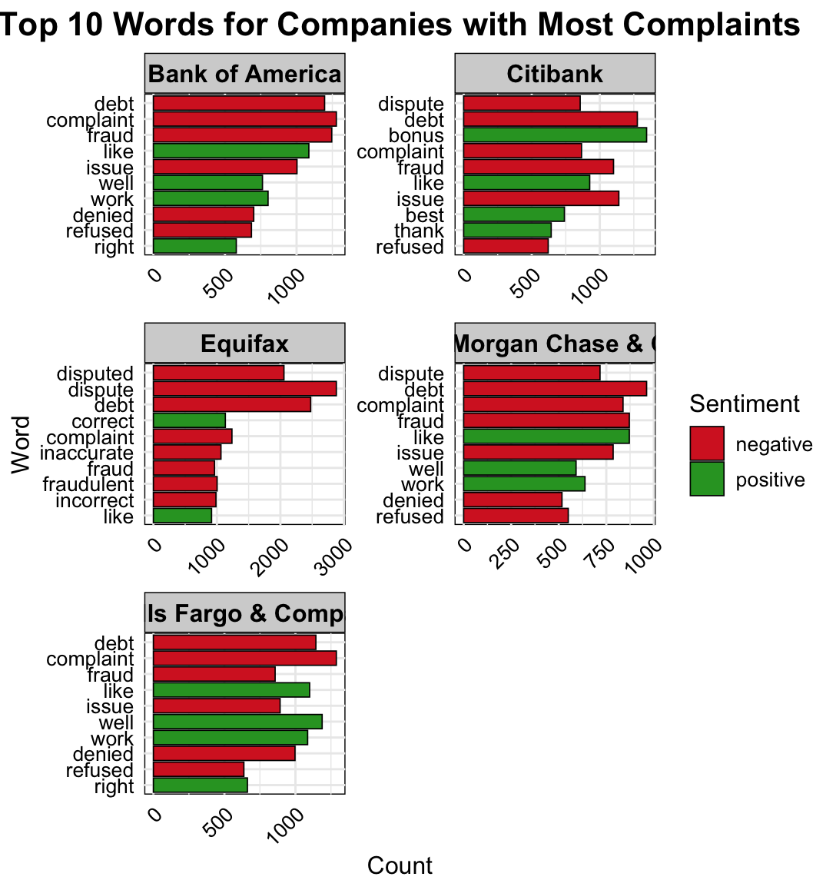
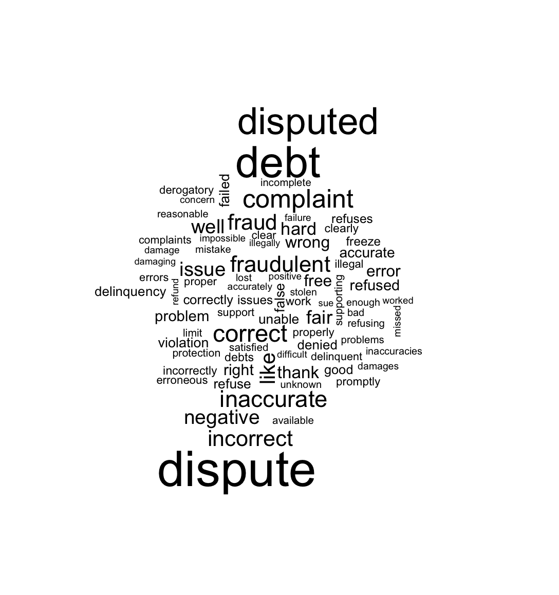

# Consumer Complaint

## Introduction
Analyized Consumer Complaint data with a emphasis on Sentiment Analysis

## Dictionary
Columns that were used
1. Product: Product that the complaint is about
2. Company: Company that received the complaint
3. Complaint ID: Unique ID for each complaint
4. word: Each word from the complaint
5. row id: unique id for each word from complaint


## Data Cleaning/Filtering

1. First selected the Columns that were necessary and filtered out null values and blank strings
```
  complaints <- df_complaints %>%
    select(`Date received`, Product, Issue, `Consumer complaint narrative`, Company, State, `Complaint ID`) %>%
    filter(!is.na(`Consumer complaint narrative`) & `Consumer complaint narrative` != "") %>%
    unnest_tokens(word, `Consumer complaint narrative`) %>%
    mutate(row_id = row_number())
```

## Data Analysis

1. Number of Complaints per Product
- I chose to do this because I thought it would be interesting to see what products produce the most complaints across all of the companies
- This data is valueable because it tells us which product needs the most improvement



2. Top 10 Words for the 10 Companies that received the most complaints
- I chose this because I thought that it would be interesting to see what words appear the most and compare them to other companies words
- I think this data is valueable because it shows what words appear the most for each company and the sentiment of the words



3. Wordcloud of the company with the most complaints (Equifax)
- I chose to emphasize this on the company with the most complaints because I thought it would be more interesting to see for an individual company
- I think this data is valuable because it shows what words appear the most in the complaints and can help narrow down what to improve


