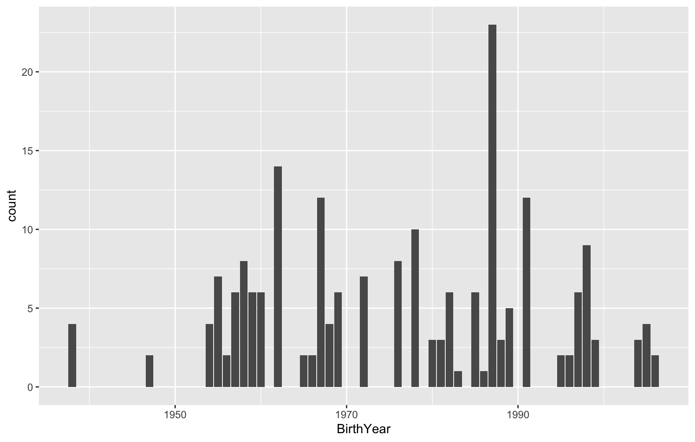

## Patient Billing Data Charts

### Reason for visit segmented by month

 Reasons for visit segmented by month

### Reason for visit based on walk in or not

 Displays the reason for visit based on if it was a walk in or not 

### Reason for visit based on city/state and zip

 Shows the reason for visit segmented by the city 

 Shows the reason for visit segmented by the zip 

### Total invoice amount based on reason for visit segmented by payment status

 Shows the total invoice for each reason for visit segmented by whether or not it has been paid

### Chart of patients birth year

 Shows that the most patients are not the elderly which I thought would be the case

