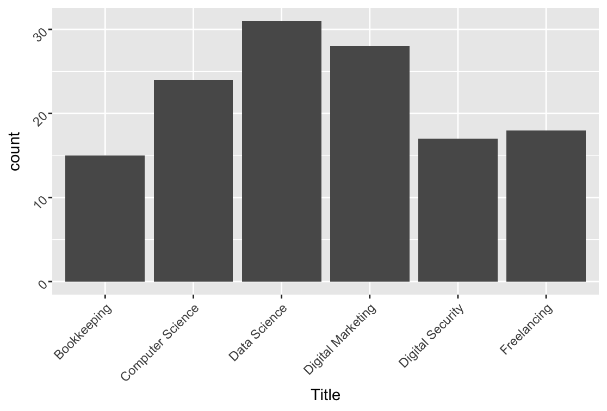

# Practice with my Read Me File 
## Student Data Charts

### Number of Majors

 Shows all the offered majors and how many students are in them 

### Student Birth Year

 Displays the birth year and the number of students for each year 

### Total Cost per major Segmented by Payment plan

 Shows the total cost of each major segmented by the payment plan status 

### Balance Due per major Segmented by Payment plan

 Shows the balance due per major segmented by the payment plan status 

